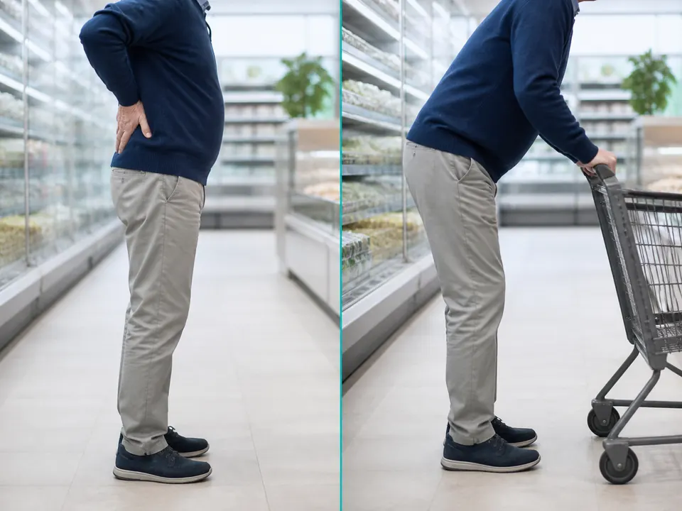
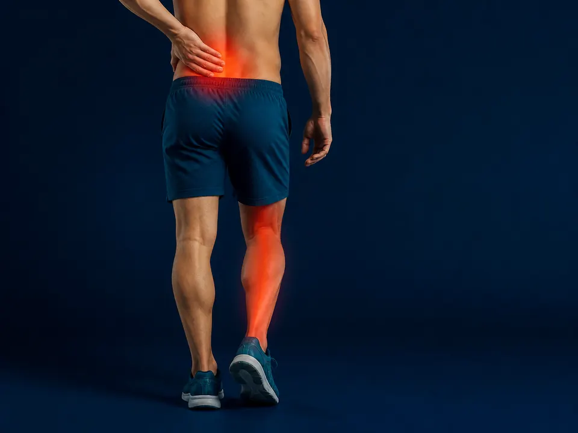
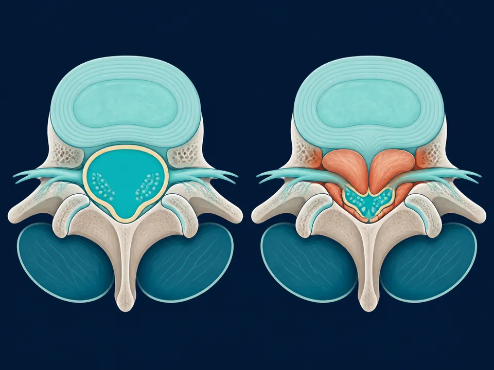

# Dolor al caminar que mejora al sentarte: ¿es estenosis?

> ¿Te duele la espalda al caminar y se te quita al sentarte? Cómo saber si es estenosis lumbar o mala circulación, con la regla del carrito de supermercado.

URL: https://neurocirujanoqueretaro.com/blog/estenosis-lumbar-dolor-al-caminar/

Saltar al contenido principal

# Dolor de espalda que empeora al caminar y mejora al sentarte:
la señal de la estenosis lumbar

Ese patrón tan específico —caminas y duele, te sientas y se calma— no es casualidad ni "cosa de la edad". Tiene nombre, causa y tratamiento.

Por Dr. Carlos Mendoza García, neurocirujano de columna · Actualizado el 10 de agosto de 2026

**Si tu dolor de espalda baja aparece o empeora al caminar y desaparece cuando te sientas o te inclinas hacia adelante, ese patrón tiene nombre: se llama claudicación neurogénica, y es el síntoma más característico de la estenosis lumbar.** Es un estrechamiento del canal por donde pasan los nervios de la columna, que los comprime justo cuando te pones de pie o caminas. No es "desgaste normal que hay que aguantar": tiene diagnóstico claro con resonancia y tratamiento efectivo. Como neurocirujano de columna en Querétaro, aquí te explico por qué ocurre, cómo se confirma y cuándo conviene operar.

Si quieres la explicación médica completa —qué es exactamente, por qué aparece y cómo se trata—, la tienes en la página de estenosis lumbar en Querétaro. Aquí nos quedamos con una sola pregunta: **¿tu dolor al caminar es estenosis, o es otra cosa?**

## ¿Por qué el dolor mejora al sentarte o inclinarte hacia adelante?

**Porque la postura cambia el tamaño del canal.** Cuando te inclinas hacia adelante, el canal lumbar se abre unos milímetros y libera a los nervios; cuando te enderezas o caminas erguido, el canal se cierra y vuelve a comprimirlos.

Ese detalle mecánico explica el signo más típico —y más útil para el diagnóstico— de la estenosis lumbar, y es la razón por la que tanta gente descubre, casi sin darse cuenta, posturas que la alivian.

La regla del carrito de supermercado

Muchos pacientes cuentan lo mismo: en el súper caminan sin problema mientras van **encorvados empujando el carrito**, pero en cuanto se enderezan o caminan sin apoyo, las piernas se cansan y tienen que detenerse. Ese "alivio al inclinarse" es tan característico de la estenosis lumbar que en consulta lo usamos como una de las primeras pistas para distinguirla de otros dolores de espalda.

## ¿Qué se siente? Los síntomas de la estenosis lumbar

El síntoma central es la **claudicación neurogénica**: molestias en las piernas que aparecen al caminar o estar de pie y ceden al sentarse. Lo que la gente describe en consulta suele ser:

- **Dolor, ardor o pesadez en las piernas que empeora al caminar** y obliga a parar cada pocas cuadras.
- **Alivio al sentarse o inclinarse hacia adelante.**
- Entumecimiento u hormigueo en glúteos, muslos o pantorrillas.
- Sensación de piernas débiles o "de trapo" tras caminar un rato.
- Tendencia a caminar ligeramente encorvado hacia adelante.

Si te reconoces en varias de estas frases, vale la pena estudiarlo. La estenosis lumbar avanza despacio, y la distancia que puedes caminar es un buen termómetro de cómo va.

## ¿Es estenosis lumbar o mala circulación en las piernas?

Es la confusión más frecuente, y distinguirlas importa porque el tratamiento es totalmente distinto. Ambas producen dolor en las piernas al caminar (por eso las dos se llaman "claudicación"), pero el origen es diferente: en la estenosis el problema es un **nervio comprimido**; en la circulación, una **arteria estrechada**. Estas señales ayudan a diferenciarlas:

SeñalEstenosis lumbar (nervio)Circulación (arteria)

**¿Qué alivia el dolor?**Sentarse o inclinarse hacia adelanteSimplemente detenerse (aunque sigas de pie)

**Ir en bicicleta**Se tolera bien (vas inclinado)También duele (el músculo pide sangre)

**Pulsos en el pie**NormalesDébiles o ausentes

**Tipo de molestia**Hormigueo, entumecimiento, pesadezCalambre muscular apretado

No es una prueba definitiva —solo un médico lo confirma con exploración y estudios—, pero el "sí camino en bici y sí me alivia inclinarme" apunta con fuerza hacia el nervio, no hacia la arteria.

## ¿Y si sí es estenosis? Lo que sigue

Si el patrón te suena y la prueba del carrito te dio la razón, el siguiente paso es confirmarlo con una exploración y, casi siempre, una resonancia magnética. Con eso se define el plan, que en la mayoría de los casos empieza sin cirugía: fisioterapia, medicamentos y ajustes en la actividad.

La cirugía se plantea cuando el dolor no cede, cuando la distancia que puedes caminar se acorta cada vez más o cuando aparece debilidad en las piernas. Las causas, el diagnóstico y las opciones de tratamiento —incluida la descompresión por mínima invasión— están explicadas a detalle en la página de estenosis lumbar.

**Si además notas pérdida del control de la orina o las heces, o debilidad repentina en las piernas, no esperes consulta: acude a urgencias.**

60+

años: la edad en que la estenosis lumbar es más frecuente

La RM

la resonancia magnética confirma el diagnóstico

24–48 h

alta hospitalaria típica en cirugía de mínima invasión

1–2 sem

regreso a actividades cotidianas en casos favorables

Lo más importante: la estenosis lumbar tiene solución, y el mejor momento para valorarla es **antes** de que la debilidad en las piernas se vuelva permanente.

Dr. Carlos Mendoza García

Neurocirujano especialista en columna vertebral, con enfoque en técnicas de mínima invasión. Consulta en Querétaro. Conoce su formación →

Si te reconociste en la regla del carrito de supermercado, el siguiente paso no es aguantar: es confirmar con estudios si el canal está realmente estrechado y en qué nivel. Esa valoración la hace un neurocirujano en Querétaro con la resonancia en mano.

Contenido informativo revisado por el Dr. Mendoza. No sustituye una consulta médica.

Porque la postura cambia el tamaño del canal por donde pasan los nervios. De pie o caminando, la columna se arquea y el canal se estrecha; al sentarte o inclinarte hacia adelante se abre unos milímetros y el nervio deja de estar comprimido. Ese patrón se llama claudicación neurógena y es la señal más típica de la estenosis lumbar.

Fíjate en qué te quita el dolor. En la estenosis lumbar se alivia al sentarte o al inclinarte hacia adelante, por eso empujar un carrito del súper ayuda. En un problema de circulación basta con detenerte aunque sigas de pie. La confirmación la da una valoración médica con exploración y estudios.

Sí, caminar no daña la columna, pero muchas personas con estenosis lumbar solo toleran distancias cortas antes de que aparezcan dolor, pesadez o entumecimiento en las piernas, y necesitan sentarse o inclinarse para aliviarse. Que la distancia que puedes caminar sea cada vez menor es una señal de que conviene valorar el caso con un neurocirujano.

No siempre. También puede deberse a un problema de circulación en las piernas, a artrosis de cadera o a una neuropatía. Por eso conviene una valoración: el patrón orienta, pero el diagnóstico se confirma con la exploración y los estudios.

## Si caminar se volvió un problema, hay solución

Trae tu resonancia y el Dr. Mendoza te dice qué opciones tienes — sin correr a quirófano.

Llamar: 442 367 9614WhatsApp
