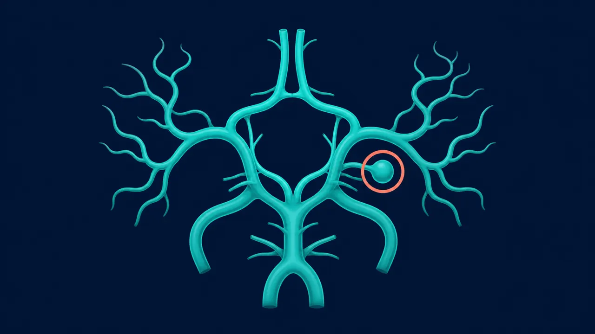

# Aneurisma Cerebral en Querétaro | Dr. Carlos Mendoza

> Aneurisma cerebral en Querétaro: diagnóstico y tratamiento por clipaje o embolización. Neurocirujano certificado. (442) 367-9614.

URL: https://neurocirujanoqueretaro.com/cerebro/aneurisma-cerebral/

> Saltar al contenido principal

# Aneurisma Cerebral en Querétaro — Tratamiento microquirúrgico y endovascular

Clipaje · Embolización · Urgencias y aneurismas no rotos · Querétaro

**Un aneurisma cerebral es una dilatación anormal en la pared de una arteria del cerebro.** La mayoría no da síntomas hasta que se rompe — y cuando se rompe, es una urgencia neuroquirúrgica. Pero cuando se detecta antes de la rotura, el tratamiento programado es muy seguro y prácticamente elimina el riesgo. En Querétaro, el Dr. Carlos Mendoza trata aneurismas cerebrales con clipaje microquirúrgico y dirige casos hacia tratamiento endovascular cuando la morfología del aneurisma lo indica.

Qué pasa por dentro

## Una dilatación en la pared de la arteria

El aneurisma es una dilatación que se forma en un punto débil de una arteria cerebral, casi siempre en las bifurcaciones. Mientras no se rompe no da síntomas; por eso, cuando se detecta, se valora su tamaño y forma para decidir entre vigilarlo o tratarlo.

## Tipos de aneurisma cerebral

No todos los aneurismas se comportan igual. Se clasifican por forma, tamaño y localización:

- **Saculares (berry aneurysm)** — los más frecuentes, con forma de bolsita que se forma en la bifurcación de arterias
- **Fusiformes** — dilatación segmentaria de toda la circunferencia de la arteria
- **Disecantes** — por rotura de la capa interna de la pared arterial
- **Micóticos** — secundarios a infección (endocarditis)

Por tamaño se clasifican en pequeños (menos de 7 mm), medianos (7-12 mm), grandes (13-24 mm) y gigantes (más de 25 mm). El tamaño, la forma y la localización definen el riesgo de rotura y la estrategia de tratamiento.

## ¿Por qué se forma un aneurisma cerebral?

Un aneurisma aparece donde la pared de la arteria es más débil, y varios factores aumentan ese riesgo. Conocerlos ayuda a decidir a quién conviene estudiar:

- **Hipertensión arterial** — la presión alta sostenida es el factor de riesgo modificable más importante
- **Tabaquismo** — daña la pared arterial y multiplica el riesgo de formación y de rotura
- **Antecedentes familiares** — tener dos o más familiares de primer grado con aneurisma eleva el riesgo
- **Enfermedades hereditarias** — como la poliquistosis renal o el síndrome de Ehlers-Danlos
- **Edad y sexo** — más frecuente después de los 40 años y algo más en mujeres
- **Consumo de cocaína o alcohol en exceso**

Si reúnes varios de estos factores —sobre todo antecedentes familiares directos— vale la pena valorar con el Dr. Mendoza si conviene un estudio de tamizaje con angiorresonancia, que no usa radiación ni contraste yodado.

## Síntomas: hay dos escenarios muy distintos

### Aneurisma no roto — hallazgo incidental o síntomas de compresión

La mayoría de los aneurismas no rotos se detectan por casualidad en una resonancia o angiorresonancia pedida por otra razón. Algunos aneurismas grandes pueden comprimir estructuras vecinas y dar síntomas como:

- Visión doble por compresión del nervio oculomotor
- Párpado caído (ptosis) y pupila dilatada
- Dolor retroocular
- Cefalea persistente en la zona del aneurisma

### Aneurisma roto — hemorragia subaracnoidea

Cuando el aneurisma se rompe, la sangre escapa hacia el espacio subaracnoideo y causa un cuadro muy típico:

- **Cefalea en trueno** — aparece en segundos, descrita como "el peor dolor de cabeza de mi vida"
- Rigidez de nuca (meningismo)
- Náuseas y vómito
- Fotofobia (molestia con la luz)
- Pérdida del estado de alerta, coma en los casos más graves
- Crisis convulsivas

**Cefalea súbita "la peor de mi vida" = urgencia**

Cualquier cefalea de inicio brusco, diferente a las habituales y de máxima intensidad desde el primer minuto, debe tratarse como hemorragia subaracnoidea hasta que una tomografía demuestre lo contrario. Acude inmediatamente a urgencias.

## Diagnóstico por imagen

El estudio correcto define morfología, cuello y relaciones del aneurisma antes de decidir cómo tratarlo:

- **Angiotomografía (angio-TC) cerebral** — estudio de primera línea en urgencias, detecta hemorragia y localiza el aneurisma
- **Angiorresonancia (angio-RM)** — útil en pacientes sin urgencia, sin radiación ni contraste yodado
- **Angiografía cerebral por cateterismo** — el estudio de mayor resolución; define morfología exacta, cuello y relaciones con otras ramas. Es indispensable para planear el tratamiento

📷 FOTO DEL DOCTOR

**Foto:** el Dr. Mendoza analizando la angiografia cerebral del aneurisma.

## Tratamiento del aneurisma cerebral

### Clipaje microquirúrgico

Consiste en abrir el cráneo (craneotomía) por la zona más cercana al aneurisma, llegar con microscopio hasta el cuello del aneurisma y colocar un clip metálico que ocluye la comunicación con la arteria. Es la técnica de referencia desde hace décadas. Con un clipaje completo, el aneurisma queda excluido de la circulación de por vida. Está indicado especialmente en:

- Aneurismas con cuello ancho difíciles de embolizar
- Aneurismas de la arteria cerebral media
- Pacientes jóvenes donde la durabilidad del tratamiento es crítica
- Casos con hematoma asociado que requiera evacuación

📷 FOTO DEL DOCTOR

**Foto:** el Dr. Mendoza realizando el clipaje microquirúrgico del aneurisma en quirofano.

### Embolización endovascular

Por vía arterial (desde la femoral o radial), se lleva un catéter hasta el aneurisma y se rellena con coils (espirales de platino) o se coloca un diversor de flujo (stent). Es una alternativa menos invasiva que el clipaje, indicada especialmente en:

- Aneurismas de circulación posterior (basilar, vertebral)
- Pacientes mayores o con comorbilidades que aumentan riesgo quirúrgico
- Aneurismas de cuello estrecho y morfología favorable

La decisión entre clipaje y embolización se toma caso por caso. En el equipo del Dr. Mendoza trabajamos en conjunto con neurorradiólogos intervencionistas para ofrecer la mejor alternativa según el aneurisma y el paciente.

Un aneurisma no roto no siempre se opera: la decisión depende de su tamaño, su forma, su localización y de tu edad y antecedentes. Si te detectaron uno en un estudio, agenda una valoración con el Dr. Carlos Mendoza para saber si en tu caso conviene tratarlo o vigilarlo.

## Después del tratamiento

- **UCI:** 24-72 horas tras hemorragia subaracnoidea (vigilancia de vasoespasmo)
- **Hospitalización total:** 7-14 días en aneurismas rotos; 3-5 días en aneurismas programados
- **Regreso a actividades:** 4-8 semanas en casos programados
- **Seguimiento con imagen** a los 6 meses, 1 año, 3 años

## Preguntas frecuentes sobre aneurisma cerebral

No. Los aneurismas pequeños (menores de 5-7 mm), asintomáticos y en localizaciones de bajo riesgo pueden vigilarse con imagen periódica. La decisión depende del tamaño, forma, localización, edad del paciente y antecedentes familiares. Los aneurismas rotos sí requieren tratamiento urgente.

Depende del aneurisma. Algunos se tratan mejor con clipaje microquirúrgico (cirugía abierta con un clip en el cuello del aneurisma), otros con embolización endovascular (rellenar el saco con coils por vía arterial). La decisión se toma caso por caso evaluando morfología, localización y estado del paciente.

La pared del aneurisma es más delgada que la del resto de la arteria. Factores como hipertensión mal controlada, tabaquismo, esfuerzo intenso o consumo de cocaína aumentan el riesgo de rotura. Cuando se rompe, la sangre escapa al espacio subaracnoideo y produce la cefalea más intensa que el paciente haya sentido.

Puede haber predisposición familiar. Si dos familiares de primer grado han tenido aneurisma, el riesgo de tenerlo es mayor y está indicado estudiarse con angiorresonancia. También hay enfermedades asociadas como la poliquistosis renal y el Ehlers-Danlos vascular.

## Un aneurisma tratado a tiempo es una vida salvada

Agenda tu consulta con el neurocirujano en Querétaro.

Llamar: 442 367-9614 WhatsApp
