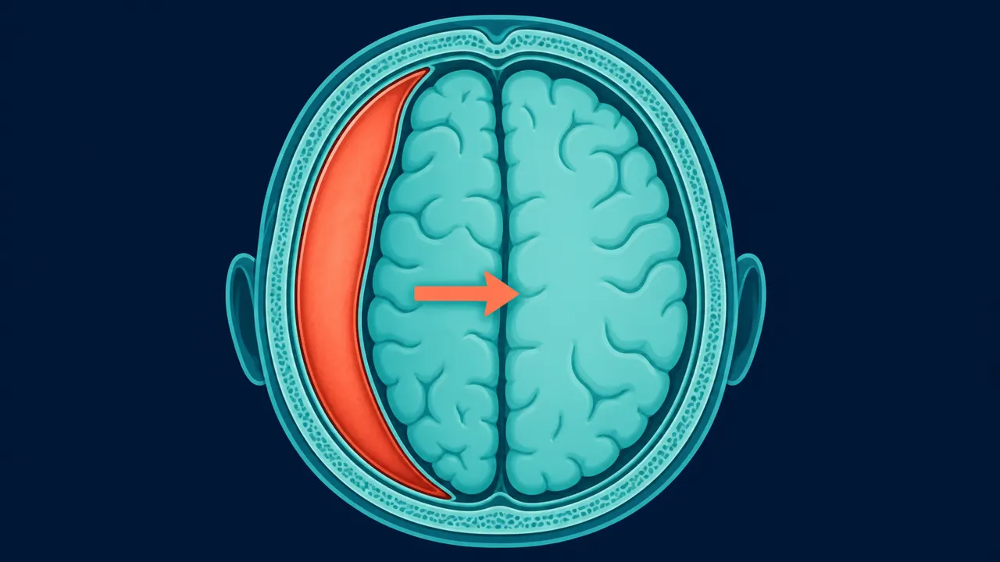

# Hematoma Subdural en Querétaro | Dr. Carlos Mendoza

> Hematoma subdural agudo y crónico en Querétaro: drenaje por trépanos o craneotomía. Neurocirujano especialista en urgencias del adulto mayor. (442) 367-9614.

URL: https://neurocirujanoqueretaro.com/cerebro/hematoma-subdural/

> Saltar al contenido principal

# Hematoma Subdural en Querétaro — Drenaje y craneotomía

Agudo y crónico · Urgencia y programado · Querétaro

**El hematoma subdural es la acumulación de sangre entre la duramadre y el cerebro.** Es una de las urgencias neuroquirúrgicas más frecuentes, sobre todo en adultos mayores. A veces aparece tras un golpe importante, pero en otras ocasiones el paciente ni siquiera recuerda el trauma — solo llegan los síntomas de confusión, pérdida de fuerza o somnolencia semanas después. En Querétaro, el Dr. Carlos Mendoza maneja el hematoma subdural agudo como urgencia y el crónico con técnicas de drenaje mínimamente invasivas que permiten una recuperación muy rápida.

## Qué pasa por dentro: sangre que comprime el cerebro

En el hematoma subdural, la sangre se acumula entre el cerebro y sus cubiertas y lo desplaza, formando la típica media luna. Según el tamaño y los síntomas, se resuelve drenándolo a través de pequeños orificios en el cráneo.

## Tipos de hematoma subdural

### Hematoma subdural agudo

Aparece en las primeras 72 horas tras un trauma importante (accidente de tránsito, caída desde altura, asalto). La sangre es fresca y aumenta de volumen rápidamente, comprimiendo el cerebro. Es una urgencia quirúrgica que requiere craneotomía evacuadora. El pronóstico depende del estado neurológico al llegar al hospital y del tiempo hasta la cirugía.

### Hematoma subdural subagudo

Entre 3 días y 3 semanas tras el trauma. La sangre está parcialmente licuada. El manejo combina características del agudo y del crónico.

### Hematoma subdural crónico

Aparece más de 3 semanas tras el trauma. Es muy frecuente en adultos mayores, pacientes con anticoagulantes y pacientes con atrofia cerebral. La sangre está licuada y rodeada de una membrana. El tratamiento de referencia es el drenaje por trépanos, una técnica muy segura con excelente pronóstico.

## ¿Por qué es más frecuente en adultos mayores?

Con la edad, el cerebro se atrofia ligeramente y se separa un poco de la duramadre. Esto estira las venas puente que unen la corteza con los senos venosos. Un golpe en la cabeza, incluso leve, puede romper una de esas venas y producir una hemorragia lenta que se acumula durante semanas. Es por eso que muchos pacientes no recuerdan ningún trauma importante.

## Síntomas del hematoma subdural

- **Cefalea progresiva** — dolor de cabeza que aumenta con los días
- **Confusión, pérdida de memoria reciente, cambios de conducta** — a veces se confunde con demencia
- **Debilidad o torpeza** de una mano, un brazo o una pierna
- **Dificultad para caminar**, inestabilidad
- Somnolencia excesiva, dificultad para mantenerse despierto
- Alteraciones del habla
- Crisis convulsivas

**En adulto mayor, ante deterioro cognitivo reciente, hay que descartar hematoma subdural**

Si un adulto mayor presenta confusión, debilidad de un lado o cambios de conducta en semanas — especialmente si toma anticoagulantes o tuvo una caída reciente — una tomografía de cráneo es obligada antes de asumir demencia u otro diagnóstico.

## Diagnóstico

La tomografía simple de cráneo muestra el hematoma con claridad. La diferencia entre agudo y crónico se establece por la densidad: el agudo se ve blanco (hiperdenso), el crónico se ve negro (hipodenso) y el subagudo es intermedio.

En casos con datos neurológicos importantes, una resonancia magnética aporta información sobre membranas, compartimentación y edema cerebral asociado.

📷 FOTO DEL DOCTOR

**Foto:** el Dr. Mendoza viendo el TAC de craneo con el hematoma subdural

## Tratamiento quirúrgico

### Drenaje por trépanos (hematoma subdural crónico)

Es la técnica estándar. Se hacen uno o dos orificios pequeños en el cráneo, se rompe la duramadre, y se drena la sangre licuada. Después se deja un drenaje por 24-48 horas para que el cerebro reexpanda el espacio. La mejoría neurológica suele ser rápida — muchos pacientes notan mejoría el mismo día.

- **Anestesia:** local + sedación o general
- **Tiempo quirúrgico:** 40-60 minutos
- **Hospitalización:** 2-4 días
- **Regreso a actividades:** 2-3 semanas

📷 FOTO DEL DOCTOR

**Foto:** el Dr. Mendoza drenando el hematoma subdural por trepano (minima invasion)

### Craneotomía evacuadora (hematoma subdural agudo)

Cuando el hematoma es agudo, la sangre está sólida y no se puede drenar por trépanos. Se requiere una craneotomía mayor para retirar el coágulo y controlar la fuente de sangrado. En casos graves con edema cerebral importante puede ser necesaria una craniectomía descompresiva (dejar el hueso fuera temporalmente para dar espacio al cerebro edematizado).

### Embolización de la arteria meníngea media

En hematomas subdurales crónicos recidivantes, la embolización de la arteria meníngea media por vía endovascular reduce el aporte sanguíneo a la membrana del hematoma y disminuye significativamente la tasa de recurrencia. Es una técnica de evolución reciente con resultados muy prometedores.

El hematoma subdural crónico aparece semanas después de un golpe que muchas veces ni se recuerda, y sus síntomas se confunden con los de la edad. Ante confusión, torpeza o dolor de cabeza persistente en una persona mayor, conviene descartarlo con un neurocirujano en Querétaro.

## Recuperación y pronóstico

- **Hematoma subdural crónico:** pronóstico excelente en la mayoría de los casos. Recuperación neurológica casi completa en las primeras 4 semanas
- **Hematoma subdural agudo:** el pronóstico depende del estado neurológico previo a la cirugía. La evacuación oportuna es clave
- Seguimiento con tomografía de control a las 4-6 semanas
- Revisión de anticoagulantes y factores de riesgo para evitar recurrencias

## Preguntas frecuentes sobre hematoma subdural

Un hematoma subdural crónico en adulto mayor es frecuente y tiene muy buen pronóstico si se diagnostica y trata a tiempo. Aparece semanas después de un golpe en la cabeza, a veces tan leve que el paciente no lo recuerda. Con un drenaje por trépanos la mejoría suele ser notable desde los primeros días.

El agudo ocurre en horas tras un trauma importante, la sangre es fresca y sólida, y requiere craneotomía urgente. El crónico aparece semanas después de un trauma pequeño, la sangre está licuada, y se drena por pequeños orificios (trépanos) en el cráneo. El manejo y el pronóstico son muy distintos.

La recurrencia tras drenaje por trépanos está reportada en un 10-20% de los casos, especialmente en pacientes con anticoagulantes. En casos con alta probabilidad de recurrencia se puede complementar el tratamiento con embolización de la arteria meníngea media, que reduce el riesgo de reacumulación.

Los anticoagulantes (warfarina, apixabán, rivaroxabán) aumentan el riesgo de hematoma subdural tras un golpe leve. Antes de la cirugía deben suspenderse o revertirse según el protocolo. Tras el drenaje, la decisión de reiniciarlos se toma evaluando el riesgo de trombosis versus el riesgo de resangrado.

## Un hematoma subdural drenado a tiempo recupera la autonomía

Consulta con el neurocirujano en Querétaro.

Llamar: 442 367-9614 WhatsApp
