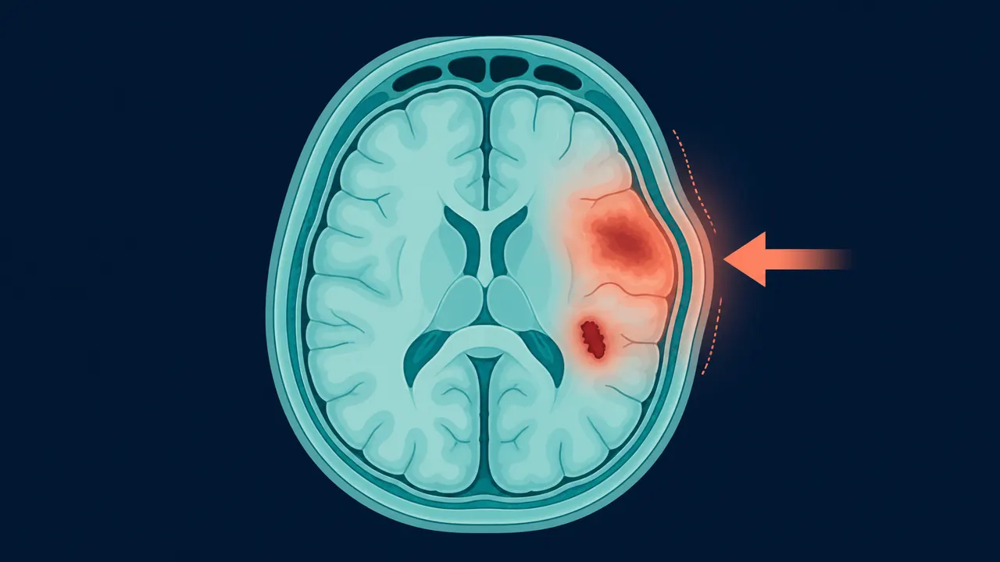

# Traumatismo Craneoencefálico Querétaro | Dr. Mendoza

> Traumatismo craneoencefálico en Querétaro: evaluación neuroquirúrgica, TAC de cráneo, fracturas, contusiones y hematomas postraumáticos. (442) 367-9614.

URL: https://neurocirujanoqueretaro.com/cerebro/traumatismo-craneoencefalico/

> Saltar al contenido principal

# Traumatismo Craneoencefálico en Querétaro

TCE leve, moderado y severo · Conmoción · Hematomas postraumáticos · Querétaro

**Un golpe en la cabeza puede parecer inofensivo — hasta que deja de serlo.** El traumatismo craneoencefálico (TCE) cubre un espectro muy amplio, desde la conmoción sin secuelas hasta el politrauma grave con riesgo vital. Lo crítico es saber cuándo vigilar en casa, cuándo pedir una tomografía y cuándo operar.

En Querétaro, el Dr. Carlos Mendoza atiende el TCE como neurocirujano: evaluación clínica rigurosa, imagen dirigida y decisión quirúrgica oportuna cuando hay hematomas, fracturas con hundimiento o edema cerebral.

## Clasificación del TCE — la escala de Glasgow

El TCE se clasifica por la escala de coma de Glasgow (GCS), que evalúa apertura ocular, respuesta verbal y respuesta motora. A mayor puntuación, mejor estado neurológico:

- **TCE leve** — GCS 13-15. Conmoción o contusión menor. Es la forma más frecuente.
- **TCE moderado** — GCS 9-12. Hay lesión cerebral demostrable en imagen en muchos casos.
- **TCE severo** — GCS 3-8. Coma, requiere UCI, manejo de vía aérea y monitoreo de presión intracraneal.

📷 FOTO DEL DOCTOR

**Foto:** el Dr. Mendoza valorando en urgencias a un paciente con traumatismo craneal (evaluación neurológica).

## Lesiones postraumáticas más frecuentes

El impacto puede dañar el cerebro de varias formas, desde alteraciones sin lesión visible hasta sangrados que exigen cirugía inmediata:

- **Conmoción cerebral** — alteración transitoria de la función sin lesión visible.
- **Contusión cerebral** — machucamiento del tejido, visible como hemorragia pequeña en TAC.
- **Hematoma epidural** — sangre entre cráneo y duramadre, típicamente por rotura de la arteria meníngea media. Urgencia quirúrgica.
- **Hematoma subdural agudo** — sangre entre duramadre y cerebro por rotura de venas puente.
- **Hemorragia subaracnoidea traumática** — sangre en el espacio entre aracnoides y piamadre.
- **Lesión axonal difusa** — lesión de fibras por aceleración-desaceleración; puede ser grave con TAC casi normal.
- **Fractura craneal lineal o con hundimiento** — puede requerir cirugía si comprime el cerebro o expone la duramadre.

## Cuándo hacer tomografía tras un TCE

Tras un golpe en la cabeza, la tomografía muestra si hay contusión, sangrado o inflamación del cerebro. Ese estudio, junto con la exploración neurológica, define si el paciente necesita vigilancia o cirugía urgente. No todo golpe requiere tomografía, pero hay criterios claros que obligan a hacerla:

- Pérdida de conciencia, aunque haya sido breve.
- Amnesia del evento o de eventos previos.
- Vómito repetido tras el trauma.
- Cefalea intensa que no cede.
- Crisis convulsiva postraumática.
- Sospecha de fractura de base de cráneo (equimosis retroauricular, ojos de mapache, salida de líquido claro por nariz u oído).
- Mecanismo de alta energía (accidente vehicular, caída desde altura).
- Edad mayor de 65 años o uso de anticoagulantes.
- Intoxicación que dificulte la exploración neurológica.

📷 FOTO DEL DOCTOR

**Foto:** el Dr. Mendoza revisando el TAC de cráneo del trauma en la pantalla.

**Signos de alarma tras un golpe en la cabeza — acude inmediatamente a urgencias**

- Pérdida de conciencia prolongada o que reaparece
- Pupila de un lado más grande que la otra
- Debilidad brusca o dificultad para hablar
- Vómito repetido, especialmente en proyectil
- Cefalea progresivamente peor
- Salida de líquido claro por oído o nariz
- Crisis convulsiva
- Somnolencia progresiva, dificultad para mantenerse despierto

## Tratamiento según gravedad

### TCE leve sin lesión en imagen

Observación domiciliaria con pautas claras: alguien que vigile y regresar si aparece un signo de alarma. Reposo cognitivo (reducir pantallas, lectura intensa y trabajo mental) durante los primeros días. Control en consulta a los 7-10 días.

### TCE con lesión en imagen que no requiere cirugía

Hospitalización con vigilancia neurológica y tomografía de control a las 6-24 horas para descartar progresión. Analgesia, control de crisis y manejo de la presión arterial.

### TCE con indicación quirúrgica

- **Hematoma epidural** mayor de 30 ml o con efecto de masa — craneotomía evacuadora urgente.
- **Hematoma subdural agudo** grueso con desviación de línea media — craneotomía evacuadora.
- **Contusión cerebral temporal** con edema expansivo — evacuación o craniectomía descompresiva.
- **Fractura con hundimiento** mayor al grosor del cráneo — elevación quirúrgica.
- **Edema cerebral refractario** al tratamiento médico — craniectomía descompresiva.

## Rehabilitación postraumática

El cerebro tiene capacidad de reorganizarse (neuroplasticidad). Un programa de rehabilitación temprano e integral es determinante en los resultados:

- **Rehabilitación física** para el déficit motor.
- **Terapia de lenguaje** en caso de afasia o disartria.
- **Rehabilitación cognitiva** para memoria, atención y funciones ejecutivas.
- **Apoyo psicológico** — la ansiedad y la depresión postraumáticas son frecuentes y tratables.
- Seguimiento neurológico regular en los primeros 12 meses.

## Preguntas frecuentes sobre TCE

Debe acudirse de inmediato si hay pérdida de conciencia, vómito repetido, cefalea muy intensa, somnolencia progresiva, convulsión, debilidad de un lado del cuerpo, pupila más grande que la otra, o salida de líquido claro por oído o nariz. En niños y adultos mayores, el umbral para hacer tomografía es más bajo.

Es el TCE leve por excelencia: un golpe produce alteración transitoria del funcionamiento cerebral sin lesión visible en tomografía. Hay cefalea, mareo, dificultad para concentrarse y a veces amnesia del evento. La mayoría se resuelve en días, pero es importante descartar lesión estructural y dar reposo cognitivo.

Es una cirugía de salvamento en casos de edema cerebral severo tras un trauma. Se retira temporalmente una parte del hueso del cráneo para dar espacio al cerebro inflamado y evitar que se comprima. Meses después, el hueso se recoloca (craneoplastia) cuando el edema ha desaparecido.

Depende de la magnitud del daño. En TCE moderado, la recuperación puede llevar de semanas a meses e incluye rehabilitación cognitiva, motora y psicológica. El cerebro tiene capacidad de plasticidad — un programa de rehabilitación temprano mejora significativamente los resultados.

## Un TCE bien atendido marca la diferencia

Agenda tu consulta con el neurocirujano en Querétaro.

Llamar: 442 367-9614 WhatsApp
