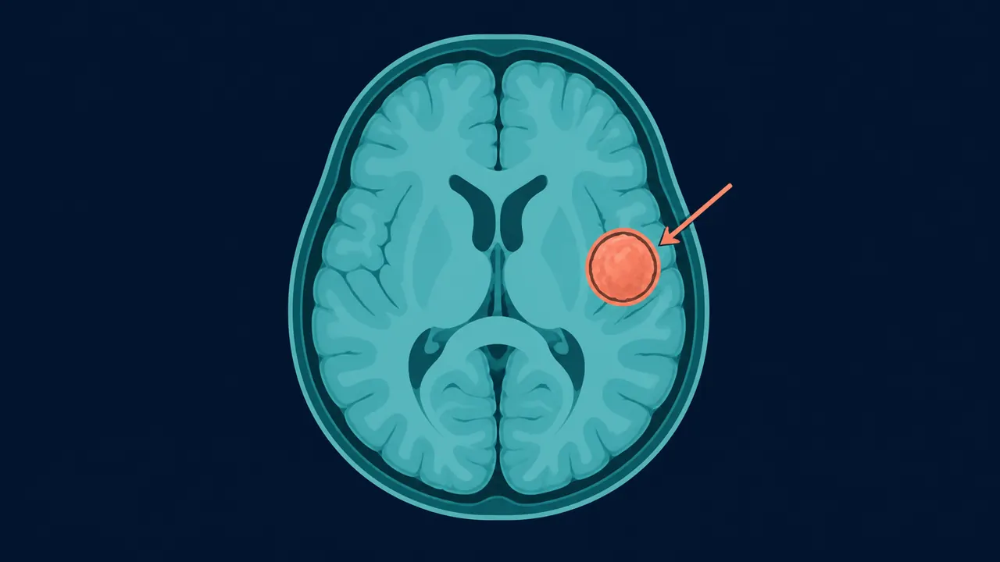

# Tumores Cerebrales en Querétaro | Dr. Carlos Mendoza

> Cirugía de tumores cerebrales en Querétaro: neuronavegación, paciente despierto y abordaje endonasal. Neurocirujano certificado. (442) 367-9614.

URL: https://neurocirujanoqueretaro.com/cerebro/tumores-cerebrales/

> Saltar al contenido principal

# Cirugía de Tumores Cerebrales en Querétaro

Neuronavegación · Paciente despierto · Endoscópica endonasal · Querétaro

**Un tumor cerebral no siempre significa cáncer, pero siempre requiere un diagnóstico exacto y un plan quirúrgico hecho a medida.** Cada tumor es distinto: un meningioma benigno del ala esfenoidal no se opera igual que un glioma en el área motora ni que un adenoma hipofisario.

En Querétaro, el Dr. Carlos Mendoza opera tumores cerebrales con neuronavegación, cirugía con paciente despierto cuando la lesión toca áreas de lenguaje o movimiento, y abordaje endoscópico endonasal para tumores de base de cráneo e hipófisis.

## Tipos de tumores cerebrales más frecuentes

No todos los tumores cerebrales se comportan igual. El tipo histológico marca el pronóstico y el tratamiento:

- **Meningiomas** — nacen de las meninges. Son casi siempre benignos y de crecimiento lento. La cirugía completa suele ser curativa.
- **Gliomas** — se originan en las células gliales del cerebro. Van desde grado I (benignos) hasta glioblastoma (grado IV).
- **Adenomas de hipófisis** — tumores de la glándula hipofisaria. Se abordan por vía endoscópica endonasal.
- **Schwannomas (neurinomas del acústico)** — tumores benignos del nervio vestibular. Causan pérdida auditiva unilateral.
- **Metástasis cerebrales** — tumores que se diseminaron desde otro órgano (pulmón, mama, melanoma).
- **Tumores de fosa posterior** — meduloblastomas, ependimomas y hemangioblastomas.

## Síntomas que deben hacer sospechar un tumor cerebral

El cerebro tolera el crecimiento lento durante mucho tiempo antes de dar síntomas. Cuando aparecen, suelen ser progresivos:

- **Cefalea nueva, progresiva** — típicamente peor por la mañana, puede mejorar con el paso del día
- **Crisis convulsivas** — cualquier primera convulsión en un adulto obliga a estudiar el cerebro con imagen
- **Déficit focal** — debilidad, entumecimiento o torpeza de un lado del cuerpo
- Alteraciones del habla, dificultad para encontrar palabras
- Cambios de conducta, memoria o personalidad
- Alteraciones visuales (visión doble, pérdida del campo visual)
- Náuseas y vómito sin relación con alimentos

**Señales de alarma que requieren evaluación urgente**

- Primera crisis convulsiva en la vida adulta
- Cefalea que despierta por la noche o acompañada de vómito en proyectil
- Déficit neurológico brusco (debilidad, pérdida del habla)
- Deterioro del estado de alerta

## Diagnóstico: resonancia magnética con contraste

La resonancia magnética de cráneo con gadolinio es el estudio de referencia. Muestra el tamaño, la localización exacta y la relación del tumor con las áreas críticas del cerebro. Ese mapa es lo que permite planear una cirugía segura con neuronavegación y, cuando la lesión toca áreas de lenguaje o movimiento, con el paciente despierto. En casos seleccionados añadimos:

- **Resonancia funcional y tractografía** — localiza áreas de lenguaje, movimiento y haces de fibras blancas para planificar el abordaje
- **Espectroscopía por RM** — orienta sobre el grado tumoral antes de la biopsia
- **Angiorresonancia o angiografía** — cuando el tumor es vascular o desplaza vasos mayores
- **PET cerebral** — diferencia tumor activo de cambios por radioterapia previa

## Cirugía con neuronavegación — precisión milimétrica

La neuronavegación fusiona la resonancia del paciente con la posición de los instrumentos en el quirófano. Funciona como un GPS que muestra en tiempo real dónde está la punta del instrumento respecto al tumor. Esto permite:

- Planear el abordaje más corto y seguro desde la piel hasta la lesión
- Evitar vasos y áreas funcionales críticas
- Confirmar el grado de resección durante la cirugía
- Reducir el tamaño de la craneotomía — lo necesario, no más

📷 FOTO DEL DOCTOR

**Foto:** el Dr. Mendoza revisando la resonancia cerebral con el tumor en el sistema de neuronavegación.

## Cirugía con paciente despierto — cuando el tumor está en área elocuente

Cuando el tumor está cerca de las áreas del lenguaje o del movimiento, la estrategia más segura es operar con el paciente despierto. Durante la parte crítica de la resección, el paciente habla, mueve la mano o lee, mientras el neurocirujano estimula el cerebro para mapear en tiempo real qué zonas controlan qué función. Así se retira el máximo tumor posible preservando la función.

El paciente no siente dolor — el cerebro no tiene receptores nociceptivos. La anestesia se maneja "dormido-despierto-dormido" con sedación a medida por un anestesiólogo especializado.

📷 FOTO DEL DOCTOR

**Foto:** el Dr. Mendoza en cirugía de tumor cerebral con neuronavegación (o cirugía con paciente despierto).

## Abordaje endoscópico endonasal — tumores de hipófisis y base de cráneo

Para tumores de la silla turca (adenomas hipofisarios), craneofaringiomas y lesiones de base de cráneo anterior, el abordaje por vía nasal con endoscopio ha reemplazado al abordaje transcraneal en la mayoría de los casos. Se accede por las fosas nasales, se atraviesa el seno esfenoidal y se llega a la silla turca — sin cortes visibles, con menor manipulación cerebral y recuperación más rápida.

## Recuperación tras cirugía de tumor cerebral

La recuperación depende del tipo de tumor, su localización y el déficit previo:

Dos tumores con el mismo nombre pueden tratarse de forma distinta según dónde estén y qué estructuras toquen. Por eso el plan no se decide por el diagnóstico solo, sino tras revisar tus estudios en una consulta de neurocirugía en Querétaro.

- **UCI:** 24-48 horas de monitoreo neurológico estrecho
- **Hospitalización total:** 4-7 días en la mayoría de los casos
- **Rehabilitación** si existe déficit motor o del lenguaje
- **Resultado histopatológico** en 7-10 días — define si se requiere radioterapia o quimioterapia complementaria
- **Regreso a actividades** entre 4 y 8 semanas según evolución

## Preguntas frecuentes sobre tumores cerebrales

No. Muchos tumores cerebrales son benignos, como los meningiomas o los adenomas hipofisarios. Pero incluso un tumor benigno puede ser grave si crece en una zona crítica del cerebro. El diagnóstico exacto lo da el análisis histopatológico de la muestra que se obtiene durante la cirugía.

Es una técnica en la que el paciente permanece despierto durante parte de la cirugía para mapear en tiempo real las áreas del cerebro que controlan el lenguaje o el movimiento. Permite retirar tumores en zonas elocuentes sin dañar funciones vitales. El paciente no siente dolor — el cerebro no tiene receptores del dolor.

Los tumores de hipófisis se abordan por vía endoscópica endonasal — a través de la nariz, sin cortes externos en la cabeza. Con un endoscopio se alcanza la silla turca y se retira el adenoma preservando el tejido hipofisario sano. La recuperación es notablemente más rápida que con abordajes abiertos.

La neuronavegación es un sistema tipo GPS que fusiona la resonancia magnética del paciente con la posición de los instrumentos en el quirófano en tiempo real. Permite planificar el abordaje más seguro, localizar el tumor con precisión milimétrica y confirmar el grado de resección durante la cirugía.

## Un tumor cerebral bien operado cambia el pronóstico

Pide tu consulta con el neurocirujano y define el mejor plan para tu caso.

Llamar: 442 367-9614 WhatsApp
