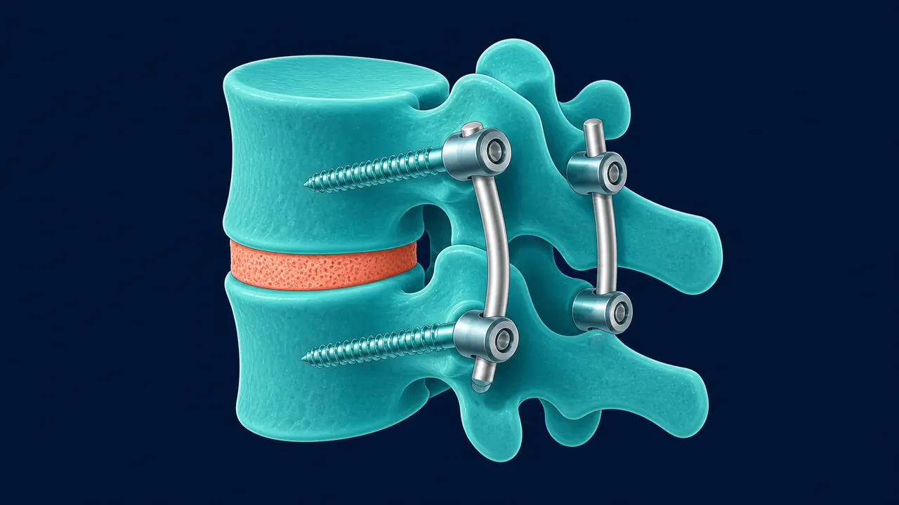

# Artrodesis de Columna en Querétaro | Dr. Carlos Mendoza

> Artrodesis de columna por mínima invasión en Querétaro. Fijación vertebral para inestabilidad, espondilolistesis y fractura. (442) 367-9614.

URL: https://neurocirujanoqueretaro.com/columna/artrodesis/

> Saltar al contenido principal

# Artrodesis de Columna en Querétaro — Fijación por mínima invasión

Neurocirujano especialista · Instrumentación vertebral · Hospital H+ Querétaro

**La artrodesis es la fusión quirúrgica de dos o más vértebras para estabilizar un segmento de la columna que genera dolor o que presenta inestabilidad.** Mediante tornillos pediculares, barras de titanio y cajas intersomáticas, se fija el nivel afectado en la posición correcta y se permite la fusión ósea.

En manos del Dr. Carlos Mendoza, neurocirujano en Querétaro, la artrodesis se realiza por mínima invasión siempre que la anatomía del paciente lo permite — con hospitalización de 2 a 3 días y regreso a actividades en semanas, no meses.

## Fijar el segmento para devolver estabilidad

La artrodesis une dos o más vértebras con tornillos y barras para eliminar el movimiento doloroso de un segmento inestable. Por mínima invasión, los tornillos se colocan por vía percutánea, con menos daño muscular y una recuperación más rápida.

## ¿Cuándo se necesita una artrodesis?

La artrodesis no es una cirugía de primera línea. Siempre se evalúan opciones menos invasivas antes. Las indicaciones reales son:

- **Espondilolistesis** — deslizamiento de una vértebra sobre otra, que genera inestabilidad y compresión nerviosa. La descompresión sin fijación empeoraría el deslizamiento.
- **Inestabilidad segmentaria** — movimiento anormal entre vértebras demostrado en radiografías funcionales, que provoca dolor mecánico crónico.
- **Estenosis con inestabilidad** — cuando la descompresión del canal requiere retirar estructuras de soporte que, sin fijación, dejarían la columna inestable.
- **Fractura vertebral inestable** — fracturas que comprometen la estabilidad de la columna y requieren fijación para proteger el sistema nervioso.
- **Hernia discal recurrente o discogenia severa** — en casos seleccionados donde el disco está completamente degenerado y es fuente de dolor irresuelto.
- **Escoliosis degenerativa del adulto** — curvaturas con dolor e inestabilidad que no responden al tratamiento conservador.

## Técnicas de artrodesis que realizo

### TLIF por mínima invasión (MIS-TLIF)

Es la técnica estándar para artrodesis lumbar por vía posterior. A través de incisiones de 2-3 cm (en lugar de los 10-15 cm de la cirugía abierta), se colocan los tornillos pediculares y la caja intersomática que fusionará el nivel. El daño muscular es mínimo porque se utilizan dilatadores en lugar de separadores abiertos.

- Incisiones: 2 x 2-3 cm
- Hospitalización: 2-3 días
- Pérdida de sangre: significativamente menor que cirugía abierta

📷 FOTO DEL DOCTOR

**Foto:** el Dr. Mendoza colocando tornillos percutaneos de fijacion por minima invasion en quirofano

### ALIF (Artrodesis lumbar anterior)

Acceso por el abdomen para colocar una caja intersomática de mayor tamaño en el espacio discal. Permite restaurar mejor la lordosis lumbar. Se combina con fijación posterior cuando es necesario.

### Artrodesis cervical (ACDF)

La fusión cervical anterior es la técnica estándar para hernia discal cervical con radiculopatía. Ver la página de hernia discal cervical para información detallada.

### Artrodesis asistida por endoscopio

En casos seleccionados, la colocación de tornillos y la preparación del espacio discal puede realizarse con asistencia endoscópica, reduciendo aún más el daño a los tejidos blandos.

## El proceso: desde la evaluación hasta el alta

1. **Evaluación completa** — resonancia magnética, radiografías funcionales (flexión-extensión) y, en casos complejos, tomografía para planificar la trayectoria de los tornillos. La planificación preoperatoria es tan importante como la técnica quirúrgica.
1. **Valoración preanestésica** — estudios de laboratorio, cardiológico si aplica, y evaluación del riesgo quirúrgico personalizado.
1. **Cirugía** — tiempo quirúrgico de 2 a 4 horas según el número de niveles y la complejidad. Anestesia general.
1. **Postoperatorio inmediato** — el paciente camina desde el primer día. Fisioterapia postural desde las primeras 24 horas.
1. **Alta hospitalaria** — 2 a 3 días según evolución.
1. **Seguimiento** — consultas al mes, 3 meses y 6 meses. Radiografías de control para confirmar la fusión ósea.

## Recuperación esperada

- **Hospitalización:** 2-3 días
- **Caminar:** desde el primer día
- **Actividades básicas:** 3-4 semanas
- **Trabajo sedentario:** 3-4 semanas
- **Trabajo físico:** 6-8 semanas
- **Deporte:** 3-6 meses (según actividad)
- **Fusión ósea completa:** 3-6 meses

📷 FOTO DEL DOCTOR

**Foto:** el Dr. Mendoza revisando la radiografia postoperatoria con la fijacion colocada

## ¿La artrodesis limita el movimiento?

Sí, el nivel fusionado pierde movimiento. Sin embargo, cuando la indicación es correcta, ese nivel ya generaba dolor o inestabilidad — es decir, no funcionaba bien de todas formas. Los niveles adyacentes compensan el movimiento perdido sin que el paciente lo note en la vida cotidiana.

La preocupación más común es la enfermedad del nivel adyacente a largo plazo. Es una realidad, pero ocurre en una minoría de pacientes y normalmente en décadas posteriores. La técnica quirúrgica correcta y la fisioterapia postoperatoria son las mejores herramientas para minimizar ese riesgo.

## ¿Qué pasa con los tornillos?

El material de osteosíntesis es de titanio grado médico, biocompatible y sin interferencia con resonancias magnéticas. Está diseñado para quedarse de por vida. Solo se retira si genera molestias locales — lo que ocurre en menos del 5% de los pacientes.

## Preguntas frecuentes sobre artrodesis de columna

La artrodesis está indicada cuando hay inestabilidad vertebral demostrada (espondilolistesis, fractura, inestabilidad segmentaria), cuando la descompresión por sí sola desestabilizaría la columna, o cuando el dolor discogénico severo no responde a tratamiento conservador prolongado. No es una cirugía de primera línea — siempre se evalúan opciones menos invasivas antes.

Sí. Los estudios comparativos muestran tasas de fusión equivalentes entre la técnica abierta y la mínimamente invasiva (MIS-TLIF). La diferencia está en la recuperación: con técnica MIS, la hospitalización es de 2-3 días y el regreso a actividades es en 3-4 semanas, frente a 5-7 días y 6-8 semanas con cirugía abierta.

Con artrodesis por mínima invasión, el alta hospitalaria es en 2-3 días. El paciente camina desde el primer día postoperatorio. El regreso a actividades básicas es en 3-4 semanas; el trabajo físico en 6-8 semanas. La fusión ósea completa tarda 3-6 meses, aunque el alivio del dolor se nota desde las primeras semanas.

Generalmente no. El material de osteosíntesis (tornillos y barras) es de titanio biocompatible y está diseñado para quedarse de por vida. Solo se retira si genera molestias locales o en casos muy específicos, lo que ocurre en menos del 5% de los pacientes.

## ¿Te recomendaron una artrodesis? Hablemos.

Antes de operarte, agenda una consulta. Confirmo si la indicación es correcta y qué técnica es mejor para tu caso.

Llamar: 442 367-9614 WhatsApp
