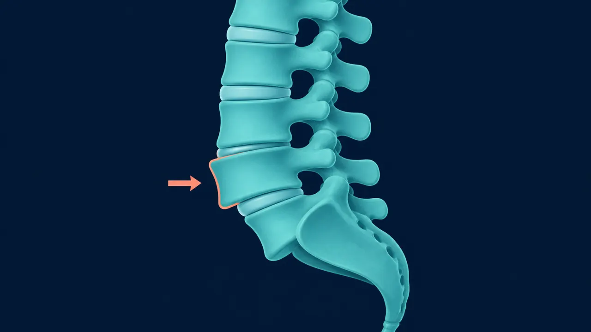

# Espondilolistesis en Querétaro | Dr. Carlos Mendoza

> Espondilolistesis lumbar en Querétaro: descompresión y artrodesis con instrumentación pedicular. Neurocirujano especialista. (442) 367-9614.

URL: https://neurocirujanoqueretaro.com/columna/espondilolistesis/

> Saltar al contenido principal

# Espondilolistesis en Querétaro — Descompresión y artrodesis

Ístmica y degenerativa · Cirugía mínimamente invasiva · Querétaro

**La espondilolistesis es el deslizamiento de una vértebra sobre la vértebra que tiene debajo.** Es una causa frecuente de dolor lumbar crónico con ciática. Lo importante no es solo el grado del deslizamiento, sino si existe inestabilidad y compresión de las raíces nerviosas.

En Querétaro, el Dr. Carlos Mendoza trata la espondilolistesis con descompresión y artrodesis (fusión) cuando los síntomas no ceden con tratamiento conservador, usando técnicas mínimamente invasivas con instrumentación pedicular.

Qué pasa por dentro

## Una vértebra se desliza sobre la otra

En la espondilolistesis, una vértebra pierde su alineación y se desplaza hacia adelante sobre la de abajo. Ese deslizamiento estrecha el canal y puede comprimir los nervios; la radiografía en flexión y extensión muestra si el segmento es inestable.

## Tipos de espondilolistesis

### Espondilolistesis ístmica

Se produce por un defecto (fractura de estrés) en la pars interarticular de la vértebra. Es frecuente en adolescentes y adultos jóvenes que practican deportes con hiperextensión repetida (gimnasia, fútbol americano, clavados). El nivel más afectado es L5-S1.

### Espondilolistesis degenerativa

Aparece en mayores de 50 años por artrosis de las facetas articulares, que pierden la capacidad de mantener la vértebra en posición. Es más frecuente en mujeres y en el nivel L4-L5. Suele asociarse a estenosis del canal lumbar.

### Otras formas

- **Congénita (displásica)** — por malformación de las facetas desde el nacimiento
- **Traumática** — tras fractura de los elementos posteriores
- **Patológica** — por tumor, infección o enfermedad ósea

## Clasificación de Meyerding (grados)

- **Grado I** — deslizamiento < 25%
- **Grado II** — deslizamiento 25-50%
- **Grado III** — deslizamiento 50-75%
- **Grado IV** — deslizamiento 75-100%
- **Grado V (espondiloptosis)** — desplazamiento completo

## Síntomas

- **Dolor lumbar mecánico** — aumenta con la actividad, al estar de pie o caminar; mejora con el reposo
- **Dolor irradiado a glúteos y piernas** — por compresión foraminal de la raíz saliente
- **Claudicación neurógena** — necesidad de parar y descansar al caminar
- Sensación de "inestabilidad" al cambiar de posición
- Espasmo de isquiotibiales, dificultad para inclinarse hacia adelante
- En casos severos, alteración de la marcha, pérdida de fuerza o control esfinteriano

**Señales de alarma**

- Debilidad brusca o progresiva en piernas
- Pérdida de control de vejiga o intestino
- Anestesia "en silla de montar"

Requieren evaluación neuroquirúrgica urgente.

## Diagnóstico por imagen

- **Radiografías de pie con proyecciones funcionales** (flexión-extensión) — cuantifican el deslizamiento y demuestran inestabilidad dinámica
- **Resonancia magnética lumbar** — evalúa el estado del disco, compresión radicular y estenosis foraminal
- **Tomografía** — útil para ver la pars interarticular y planificar los tornillos pediculares

📷 FOTO DEL DOCTOR

**Foto:** el Dr. Mendoza revisando la radiografia en flexion-extension para ver si el segmento es inestable.

## Tratamiento

### Conservador

Primera línea en la mayoría de los casos sin déficit neurológico. Incluye:

- Fisioterapia con énfasis en fortalecimiento del core y de los estabilizadores lumbopélvicos
- Evitar actividades de hiperextensión
- Analgésicos y antiinflamatorios
- Infiltraciones facetarias o foraminales en casos seleccionados

### Quirúrgico — descompresión más artrodesis

Indicado cuando hay déficit neurológico, dolor incapacitante que no cede con tratamiento conservador, o progresión documentada del deslizamiento. La cirugía tiene dos objetivos:

1. **Descomprimir** las raíces nerviosas afectadas
1. **Estabilizar** el segmento inestable mediante artrodesis con instrumentación pedicular y caja intersomática

Las técnicas más usadas son la TLIF (transforaminal lumbar interbody fusion) y la PLIF (posterior lumbar interbody fusion), ambas realizables por mínima invasión. La caja intersomática restaura la altura del disco y libera el foramen.

La clave en la espondilolistesis es distinguir si la vértebra está simplemente desplazada o además se mueve de forma anormal, porque eso cambia por completo el tratamiento. Esa diferencia solo se ve en radiografías dinámicas interpretadas por un neurocirujano especialista en columna.

📷 FOTO DEL DOCTOR

**Foto:** el Dr. Mendoza en quirofano colocando la fijacion (artrodesis) del segmento.

## Recuperación

- **Hospitalización:** 2-4 días
- **Caminar:** desde el primer día
- **Actividades básicas:** 3-4 semanas
- **Trabajo de oficina:** 4-6 semanas
- **Actividad física completa:** 4-6 meses (cuando la fusión está consolidada)

## Preguntas frecuentes sobre espondilolistesis

La clasificación de Meyerding va de grado I a V. Grados I y II son los más frecuentes y en la mayoría se manejan sin cirugía. Los grados III-V son más severos y suelen requerir tratamiento quirúrgico. La decisión depende del dolor, del déficit neurológico y de la progresión documentada.

No. Una vez que la vértebra se ha desplazado, no regresa a su posición por sí sola ni con fisioterapia. Sin embargo, los síntomas sí pueden controlarse con tratamiento conservador en muchos casos. La cirugía se reserva para cuando los síntomas son incapacitantes o progresan.

Es una fusión vertebral en la que, además de los tornillos pediculares, se coloca una caja con injerto óseo en el espacio del disco intervertebral. Esto restaura la altura del disco, libera los agujeros por donde salen las raíces y permite una fusión más sólida.

Sí, tras completar la rehabilitación y confirmar por imagen que la fusión consolidó (entre 6 y 12 meses), la mayoría de los pacientes regresa a la actividad física, incluso a deportes de impacto. Se recomienda evitar hiperextensión repetida y cargas axiales máximas.

## La espondilolistesis bien tratada devuelve la movilidad

Agenda tu consulta con el neurocirujano en Querétaro.

Llamar: 442 367-9614 WhatsApp
