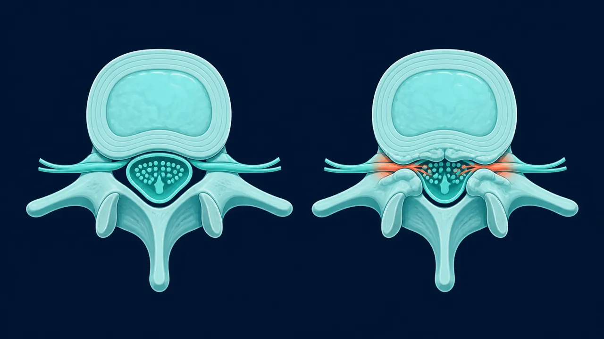

# Estenosis Lumbar en Querétaro | Dr. Carlos Mendoza

> Estenosis lumbar en Querétaro: dolor al caminar, piernas cansadas o entumecidas. Neurocirujano especialista en columna. Diagnóstico completo. (442) 367-9614.

URL: https://neurocirujanoqueretaro.com/columna/estenosis-lumbar/

> Saltar al contenido principal

# Estenosis Lumbar en Querétaro — Especialista en canal lumbar estrecho

Neurocirujano especialista · Descompresión por mínima invasión · Querétaro

**La estenosis lumbar es el estrechamiento del canal medular en la zona baja de la espalda que comprime las raíces nerviosas.** El síntoma más característico es el dolor en piernas que aparece al caminar y obliga a parar — y que alivia de inmediato al sentarse. Muchos pacientes describen que "caminar con carrito del súper es más cómodo" porque inclinarse hacia adelante abre el canal.

En Querétaro, el Dr. Carlos Mendoza trata la estenosis con descompresión quirúrgica mínimamente invasiva cuando el tratamiento conservador no es suficiente.

## ¿Por qué se estrecha el canal lumbar?

El canal medular lumbar es el espacio por donde pasan las raíces nerviosas que van hacia las piernas. Con los años, los componentes que rodean ese canal se van engrosando:

- **Ligamento amarillo** — se hipertrofia y engrosa hacia adentro del canal
- **Facetas articulares** — la artrosis genera osteofitos (hueso nuevo) que invaden el canal
- **Disco intervertebral** — la protrusión o hernia discal añade volumen al canal ya estrecho
- **Espondilolistesis** — el deslizamiento de una vértebra reduce el diámetro del canal

El resultado es que los nervios que viajan por ese canal quedan comprimidos, especialmente cuando la columna está en extensión (posición de pie, caminando). Al flexionarla (sentado, inclinado) el canal se abre levemente y la presión disminuye — de ahí el alivio al sentarse. Comparado con un canal sano se entiende por qué aparecen el dolor y la pesadez en las piernas al caminar.

## Síntomas de la estenosis lumbar

La estenosis tiene una presentación clínica bastante característica que la distingue de otras causas de dolor lumbar: ¿No tienes claro si tu dolor al caminar es estenosis o un problema de circulación? Te lo explicamos en dolor al caminar que mejora al sentarte.

- **Claudicación neurógena** — dolor, pesadez o entumecimiento en piernas al caminar que obliga a parar. Mejora al sentarse en minutos.
- Sensación de "piernas cansadas" o "como de plomo" con distancias cortas
- Hormigueo o entumecimiento en nalgas, muslos, pantorrillas o pies
- Dolor lumbar bajo, frecuentemente irradiado a ambas piernas
- Dificultad para permanecer de pie más de pocos minutos
- Alivio al inclinarse hacia adelante, sentarse o estar en cuclillas

**Señales de alarma**

- Pérdida de control de vejiga o intestino
- Debilidad brusca en una o ambas piernas
- Dificultad para caminar que progresa en días

Estos síntomas requieren evaluación neuroquirúrgica urgente — pueden indicar compresión severa de la cola de caballo.

## Diagnóstico: imagen antes de cualquier decisión

La resonancia magnética lumbar es el estudio esencial. Muestra con claridad el grado de estrechez del canal, qué estructuras lo están causando y qué niveles están afectados. En casos con sospecha de inestabilidad, se añaden radiografías funcionales (flexión-extensión) para evaluar si hay movimiento anormal entre vértebras.

La exploración neurológica evalúa fuerza, reflejos y sensibilidad en piernas para cuantificar el grado de daño nervioso actual.

📷 FOTO DEL DOCTOR

**Foto:** el Dr. Mendoza mostrando en la resonancia el canal estrechado al paciente.

## Tratamiento conservador: la primera línea siempre

En estenosis leve a moderada, el tratamiento conservador puede controlar los síntomas por períodos prolongados:

- Fisioterapia lumbar con énfasis en flexión (ejercicios que abren el canal)
- Antiinflamatorios y analgésicos para manejo del dolor
- Inyecciones epidurales de corticoide — reducen la inflamación local y dan alivio temporal
- Modificación de actividades: evitar extensión prolongada, usar bastón o andadera si ayuda

Si los síntomas limitan significativamente la calidad de vida, la distancia que se puede caminar se reduce a menos de 100 metros, o existe daño neurológico progresivo, la cirugía es el paso correcto.

## Cirugía de descompresión lumbar por mínima invasión

El objetivo de la cirugía es retirar los tejidos que comprimen el canal — sin desestabilizar la columna. A través de incisiones pequeñas y con microscopio o endoscopio, se elimina el ligamento amarillo hipertrofiado, los osteofitos de las facetas y cualquier protrusión discal que reduzca el canal.

📷 FOTO DEL DOCTOR

**Foto:** el Dr. Mendoza operando una descompresión lumbar por mínima invasión.

### Laminectomía mínimamente invasiva

Técnica estándar para estenosis de canal central. Se retira parte del arco posterior de la vértebra (lámina) para descomprimir las raíces. Con técnica mínimamente invasiva, se preservan los músculos paravertebrales y la cicatrización es notablemente mejor que con cirugía abierta.

### Descompresión endoscópica

Para casos seleccionados, la descompresión puede realizarse a través de un endoscopio con incisión de menos de 1 cm. Permite visualizar y tratar la compresión con mínimo daño a los tejidos circundantes.

### Descompresión con artrodesis

Cuando la estenosis se asocia a inestabilidad vertebral o espondilolistesis, descomprimir sin estabilizar puede empeorar la situación. En estos casos, la descompresión se combina con artrodesis (fijación) del nivel afectado. Ver la página de artrodesis de columna para más información.

## Resultados y recuperación

La cirugía de descompresión lumbar tiene uno de los mejores resultados en toda la cirugía de columna. La mayoría de los pacientes nota alivio inmediato del dolor en piernas desde el primer día postoperatorio.

Dicho esto, la mayoría de los pacientes con estenosis lumbar no termina en quirófano. Antes de plantear cirugía conviene agotar el tratamiento conservador y confirmar que el estrechamiento explica tus síntomas — que es justo lo que se revisa en una consulta con un neurocirujano en Querétaro.

- **Hospitalización:** 1-2 días
- **Caminar:** desde el mismo día de la cirugía
- **Actividades básicas:** 2-3 semanas
- **Actividad física completa:** 4-6 semanas
- **Conducir:** 2-3 semanas

## Preguntas frecuentes sobre estenosis lumbar

Es el síntoma característico de la estenosis lumbar: dolor, entumecimiento o pesadez en las piernas que aparece al caminar cierta distancia y obliga a parar. El alivio llega al sentarse o inclinarse hacia adelante. A diferencia de la claudicación vascular, el pulso en los pies es normal.

En casos leves a moderados, el tratamiento conservador puede controlar los síntomas por meses o años. Sin embargo, la estenosis es una condición estructural: el canal no se agranda solo. Si la calidad de vida se deteriora progresivamente, la cirugía descompresiva es la solución definitiva.

En la mayoría de los casos la estenosis progresa lentamente. Los síntomas van limitando más la distancia que se puede caminar. En casos severos puede haber pérdida de fuerza permanente en piernas o problemas para controlar la vejiga. La cirugía temprana da mejores resultados que esperar a que el daño neurológico sea avanzado.

Con descompresión mínimamente invasiva, la hospitalización es de 1 a 2 días. La mayoría de los pacientes camina sin dolor desde el primer día postoperatorio. El regreso a actividades básicas es en 2 a 3 semanas; la actividad física completa en 4 a 6 semanas.

## Recupera tu capacidad de caminar

La estenosis lumbar tiene solución. Agenda tu consulta hoy.

Llamar: 442 367-9614 WhatsApp
