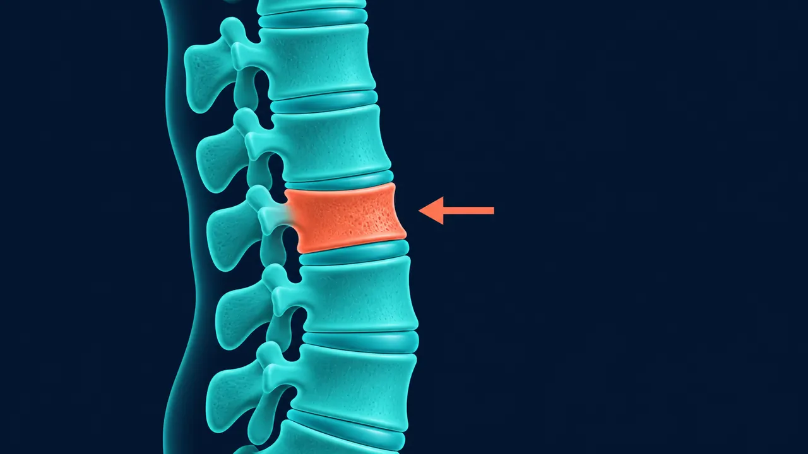

# Fractura Vertebral en Querétaro | Dr. Carlos Mendoza

> Fractura vertebral osteoporótica y traumática en Querétaro: vertebroplastia, cifoplastia y fijación con tornillos. (442) 367-9614.

URL: https://neurocirujanoqueretaro.com/columna/fractura-vertebral/

> Saltar al contenido principal

# Fractura Vertebral en Querétaro — Vertebroplastia, cifoplastia y fijación

Osteoporóticas y traumáticas · Mínima invasión · Querétaro

**Una fractura vertebral es la rotura de una vértebra y puede ir desde un colapso menor que cede con analgésicos hasta una fractura inestable con riesgo medular que requiere cirugía urgente.** En adultos mayores, muchas veces aparece tras un esfuerzo mínimo — levantarse de una silla, toser, una caída leve — porque el hueso está osteoporótico.

En Querétaro, el Dr. Carlos Mendoza trata fracturas vertebrales con técnicas mínimamente invasivas como vertebroplastia y cifoplastia, y fijación quirúrgica cuando la fractura es inestable.

Qué pasa por dentro

## La vértebra pierde altura y se colapsa

En una fractura por compresión, el cuerpo vertebral se aplasta en forma de cuña, muchas veces por osteoporosis o un traumatismo. Definir si la fractura es estable o compromete el canal indica si se trata de forma conservadora o con cirugía.

## Tipos de fractura vertebral

### Fracturas osteoporóticas

Son las más frecuentes, sobre todo en mujeres posmenopáusicas y adultos mayores. El cuerpo vertebral se colapsa por fragilidad ósea, incluso sin un trauma mayor. Suelen localizarse en la transición dorsolumbar (T11-L2). Provocan dolor agudo que mejora en semanas, pero si no se tratan pueden dejar cifosis y aumentar el riesgo de nuevas fracturas.

### Fracturas traumáticas

Por accidentes de alta energía: vehiculares, caídas desde altura, contusión directa. Se clasifican por el patrón (compresión, estallido, flexión-distracción, luxofractura) y el compromiso neurológico. Algunas son estables y se tratan con corsé; otras son inestables y requieren fijación quirúrgica.

### Fracturas patológicas

Por metástasis, mieloma múltiple o tumor primario del cuerpo vertebral. El manejo combina tratamiento oncológico con estabilización de la fractura.

## Síntomas

- **Dolor dorsal o lumbar agudo** que aparece tras un esfuerzo, caída o incluso sin causa aparente
- Dolor que aumenta con el movimiento (giro, agacharse) y mejora en reposo acostado
- Pérdida de estatura progresiva tras fracturas repetidas
- Deformidad en cifosis (joroba) cuando hay varias vértebras colapsadas
- Dolor irradiado a tórax o abdomen siguiendo el trayecto de la raíz nerviosa correspondiente
- En fracturas con compromiso medular: debilidad, pérdida sensitiva o alteración esfinteriana

**Signos de alarma — acude inmediatamente**

- Debilidad o pérdida de sensibilidad en extremidades tras un trauma
- Pérdida de control de vejiga o intestino
- Dolor severo con deformidad visible de la espalda
- Antecedente de trauma importante con dolor de espalda progresivo

## Diagnóstico

El diagnóstico correcto define el tratamiento. El Dr. Mendoza combina varios estudios de imagen:

- **Radiografías** — primera línea; muestran colapso vertebral y ángulo de cifosis
- **Tomografía** — define el patrón de fractura, compromiso del muro posterior y planificación quirúrgica
- **Resonancia magnética** — distingue fractura aguda de fractura crónica, evalúa edema óseo, médula espinal y descarta causa patológica
- **Densitometría ósea** — cuantifica la osteoporosis para el tratamiento a largo plazo

📷 FOTO DEL DOCTOR

**Foto:** el Dr. Mendoza viendo el TAC/radiografia de la fractura vertebral.

## Tratamiento

### Tratamiento conservador

Indicado en fracturas estables sin compromiso neurológico:

- Analgesia adecuada
- Corsé o faja lumbar por 6-12 semanas
- Movilización progresiva con apoyo de fisioterapia
- Tratamiento de la osteoporosis de base (bifosfonatos, denosumab, teriparatide)
- Suplemento de calcio y vitamina D

### Vertebroplastia y cifoplastia

Procedimientos mínimamente invasivos para fracturas osteoporóticas con dolor incapacitante que no cede con analgésicos. A través de una aguja que entra en el cuerpo vertebral se inyecta cemento óseo (metacrilato). El cemento estabiliza la fractura y alivia el dolor de forma notable en las primeras 24-48 horas. La cifoplastia añade un balón que se infla antes del cemento para recuperar algo de la altura del cuerpo vertebral.

- **Anestesia:** local + sedación
- **Tiempo:** 30-60 minutos por nivel
- **Hospitalización:** ambulatoria o 1 día
- **Regreso a actividades:** 1-2 semanas

📷 FOTO DEL DOCTOR

**Foto:** el Dr. Mendoza explicando al paciente el tratamiento de la fractura (vertebroplastia o manejo conservador).

### Fijación con tornillos pediculares

Indicada en fracturas inestables, fracturas por estallido con fragmentos en el canal, luxofracturas o cuando hay déficit neurológico. Se colocan tornillos en los pedículos de las vértebras por encima y por debajo de la fractura y se conectan con barras. Puede combinarse con descompresión si hay compresión medular.

## Prevención de nuevas fracturas

Tras una primera fractura osteoporótica el riesgo de otra aumenta 4-5 veces. Por eso el tratamiento no acaba con la fractura:

Una fractura vertebral por osteoporosis rara vez es un hecho aislado: es un aviso. Además de tratar la fractura, hay que estudiar y tratar el hueso para que no venga la siguiente, y ese seguimiento lo coordina el Dr. Carlos Mendoza junto con tu médico tratante.

- Tratamiento farmacológico de la osteoporosis ajustado por densitometría
- Calcio 1000-1200 mg/día y vitamina D 800-1000 UI/día
- Ejercicio de fuerza y equilibrio
- Prevención de caídas: retirar alfombras sueltas, iluminación, barras de apoyo en baño
- Revisión periódica por endocrinología en osteoporosis severa

## Preguntas frecuentes sobre fractura vertebral

Es un procedimiento mínimamente invasivo en el que se inyecta cemento óseo dentro del cuerpo vertebral fracturado a través de una aguja. Estabiliza la fractura y alivia el dolor de forma notable en la mayoría de los pacientes. La cifoplastia es una variante que infla un balón antes del cemento para recuperar algo de la altura del cuerpo vertebral.

No. Las fracturas estables, sin compromiso neurológico y con dolor controlable se manejan con analgésicos, corsé y movilización progresiva. La cirugía se reserva para fracturas inestables, dolor intratable, déficit neurológico o deformidad progresiva.

Tras una primera fractura osteoporótica, el riesgo de otra aumenta significativamente. La prevención integra tratamiento de la osteoporosis (bifosfonatos, denosumab, teriparatide), calcio y vitamina D, ejercicio de fuerza y prevención de caídas en el domicilio.

Sin procedimiento, el dolor agudo suele mejorar en 6-12 semanas mientras la fractura consolida. Con vertebroplastia o cifoplastia, el alivio es mucho más rápido — la mayoría de los pacientes refiere mejoría notable en las primeras 24-48 horas tras el procedimiento.

## Una fractura bien tratada evita secuelas permanentes

Agenda tu consulta con el neurocirujano en Querétaro.

Llamar: 442 367-9614 WhatsApp
