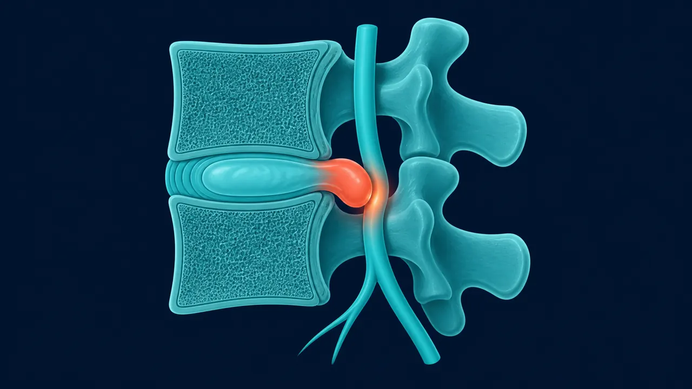

# Hernia Discal Lumbar en Querétaro | Dr. Carlos Mendoza

> Hernia discal lumbar en Querétaro: un diagnóstico preciso y un tratamiento a tiempo pueden evitar la cirugía. Dr. Carlos Mendoza, neurocirujano. 442 367 9614.

URL: https://neurocirujanoqueretaro.com/columna/hernia-discal-lumbar/

Saltar al contenido principal

# Hernia Discal Lumbar en Querétaro
Tratamiento dirigido y especializado

¿Dolor de espalda que baja por la pierna? Puede ser una hernia lumbar. Un diagnóstico preciso y un tratamiento a tiempo pueden evitar una cirugía.

442 367 9614 WhatsApp

**La hernia discal lumbar es el problema de columna más frecuente en adultos de 30 a 60 años.** Ocurre cuando el núcleo gelatinoso de un disco intervertebral en la zona lumbar se desplaza y presiona las raíces nerviosas, causando dolor intenso, ciática y — en casos severos — pérdida de fuerza en las piernas.

El Dr. Carlos Mendoza, neurocirujano especialista en columna en Querétaro, evalúa cada caso de hernia lumbar con estudios de imagen completos antes de recomendar cualquier tratamiento. La cirugía es siempre el último recurso.

## ¿Qué es una hernia discal lumbar?

Los discos intervertebrales actúan como amortiguadores entre las vértebras. Cada disco tiene un núcleo blando (núcleo pulposo) rodeado por una cubierta fibrosa (anillo fibroso). Cuando el anillo se debilita o se rompe, el núcleo puede desplazarse y comprimir las raíces nerviosas que pasan por ahí.

Las hernias más frecuentes ocurren en los niveles **L4-L5 y L5-S1**, que son los segmentos de la columna lumbar que soportan mayor carga y movimiento.

En la hernia lumbar, el material del disco se sale y presiona la raíz del nervio a su salida de la columna. Esa compresión es la que produce el dolor que baja por la pierna. La resonancia muestra el nivel exacto y el lado afectado, y con eso se decide el tratamiento.

## Síntomas que pueden indicar una hernia lumbar

- **Dolor lumbar intenso** — especialmente al agacharse, al toser o al estar sentado por largo tiempo
- **Dolor irradiado a la pierna** — que recorre la cadera, el muslo, la pantorrilla y el pie (ciática)
- **Entumecimiento u hormigueo** — en pierna, pie o dedos del pie
- **Pérdida de fuerza** — dificultad para levantar el pie, para pararse de puntillas o para subir escaleras
- **Dolor que empeora de noche** — o con ciertos movimientos específicos

**Si tienes pérdida de control de esfínteres (orina o heces), busca atención médica de urgencia.** Es un síntoma de síndrome de cola de caballo que requiere cirugía inmediata.

## Diagnóstico completo antes de operar

El Dr. Mendoza no opera sin entender completamente el caso. El proceso diagnóstico incluye:

- Historia clínica detallada: tiempo de evolución, tipo de dolor, factores que lo agravan
- Exploración neurológica: reflejos, fuerza muscular, sensibilidad
- Resonancia magnética (RM) de columna lumbar — el estudio definitivo para confirmar la hernia, su tamaño y nivel
- Electromiografía si hay duda sobre el nivel de afectación nerviosa

📷 FOTO DEL DOCTOR

**Foto:** el Dr. Mendoza señalando en la resonancia lumbar la hernia que comprime el nervio, explicándola al paciente.

## Tratamiento: primero conservador, cirugía cuando es necesario

### Tratamiento conservador (primera línea)

Aproximadamente el 80% de las hernias discales lumbares mejoran sin cirugía en 4 a 6 semanas con:

- Antiinflamatorios y relajantes musculares controlados
- Fisioterapia dirigida (no genérica) — ejercicios de estabilización lumbar
- Modificación temporal de actividades — reducir lo que agrava el dolor
- Inyecciones epidurales de corticoesteroides en casos seleccionados

### Cirugía endoscópica de hernia lumbar (cuando el conservador no es suficiente)

Cuando el dolor es incapacitante después de 4-6 semanas o hay daño neurológico progresivo, la cirugía es la solución correcta. El Dr. Mendoza realiza la técnica endoscópica:

- **Incisión menor a 1 cm** — sin apertura muscular extensa
- Visión amplificada con endoscopio de alta definición
- Extirpación precisa solo del tejido herniado, sin dañar estructuras adyacentes
- Alta hospitalaria en 24 horas en la mayoría de los casos
- Regreso a actividades básicas en 7-14 días

El Dr. Mendoza se formó específicamente en cirugía endoscópica monoportal y biportal en Bogotá, Colombia (2024), una de las técnicas más avanzadas disponibles actualmente para hernias lumbares.

📷 FOTO DEL DOCTOR

**Foto:** el Dr. Mendoza operando una microdiscectomía/descompresión lumbar por mínima invasión, en quirófano.

## ¿Cuánto tarda la recuperación?

- **Día 1-2:** Alta hospitalaria, caminar con apoyo
- **Semana 1-2:** Actividades cotidianas ligeras, trabajo de escritorio
- **Semana 3-4:** Trabajo físico moderado, conducir
- **Semana 4-6:** Retorno a ejercicio y actividad física completa

Una hernia discal lumbar ocurre cuando el núcleo gelatinoso de un disco intervertebral en la zona baja de la espalda se desplaza y comprime las raíces nerviosas cercanas. Provoca dolor lumbar, dolor irradiado a la pierna (ciática), entumecimiento y en casos severos, pérdida de fuerza.

No. Aproximadamente el 80% de las hernias discales mejoran con tratamiento conservador en 4-6 semanas. La cirugía se recomienda cuando hay daño neurológico progresivo, cuando el dolor es incapacitante o cuando el tratamiento conservador no produce mejoría en el tiempo esperado.

Con cirugía endoscópica, la mayoría de los pacientes sale caminando el mismo día. El regreso a actividades básicas es en 1-2 semanas. A las 4-6 semanas puede retomarse la actividad física completa. El Dr. Mendoza explica los tiempos exactos según cada caso antes de cualquier procedimiento.

En muchos casos el material herniado se reabsorbe parcialmente y los síntomas mejoran. Sin embargo, si hay compresión severa del nervio o daño neurológico progresivo, la espera puede causar daño permanente. Lo correcto es que un especialista evalúe el caso con imagen antes de decidir el camino a seguir.

## El dolor lumbar tiene solución. Hablemos.

Diagnóstico en la primera consulta. Sin rodeos.

Llamar: 442 367 9614WhatsApp
